# Learning Flutter

Repository to track my progression of Learning Flutter.

---

## Phase 1: Foundation

This phase covers the core building blocks of Flutter, including widget trees, basic layouts, state management, and object-oriented programming.

### 1. Personal Business Card
A static layout application to understand the basic widget tree.
* **Concepts Learned:** `Scaffold`, `Row`, `Column`, `CircleAvatar`, and `Card`.
* [View Source Code](Foundation/personal_business_card/)

---

### 2. Dice Roller
An app to learn how data changes and how to update the screen.
* **Concepts Learned:** `StatefulWidget`, `setState()`, and dynamic image rendering.
* [View Source Code](Foundation/dice_roller/)

---

### 3. Soundboard
Audio-playing app focusing on third-party audio package.
* **Concepts Learned:** Reusable custom widgets, passing arguments, and integrating `pub.dev` packages.
* [View Source Code](Foundation/soundboard_xylophone/)

---

### 4. Quiz App
A true/false quiz game.
* **Concepts Learned:** Object-Oriented Programming (Dart Classes), Lists, logic loops, and `AlertDialog`.
* [View Source Code](Foundation/quiz_app/)

---

### 5. Basic Joke API
Joke API to fetch jokes.
* **Concepts Learned:** Data fetching using basic API (no api key just uri) and displaying it, and used `http` package.
* [View Source Code](Foundation/basic_joke_api/)

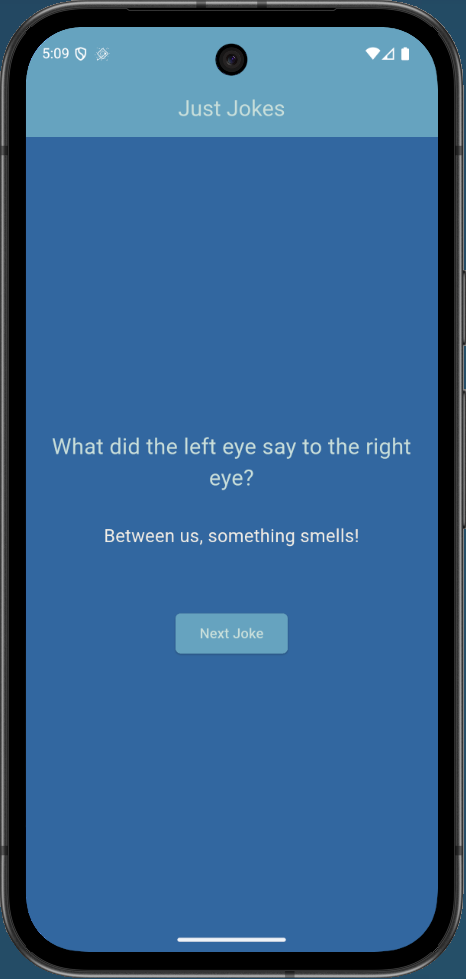
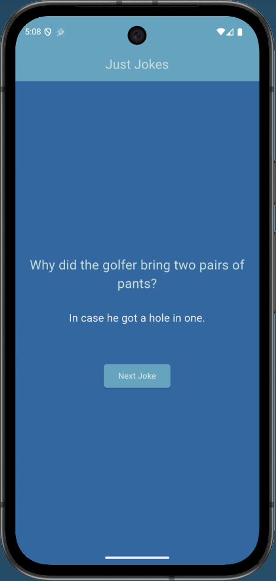

---

### 6. Basic Storage
Local Storage for data.
* **Concepts Learned:** Storing Data locally using Shared preference package.
* [View Source Code](Foundation/basic_storage/)

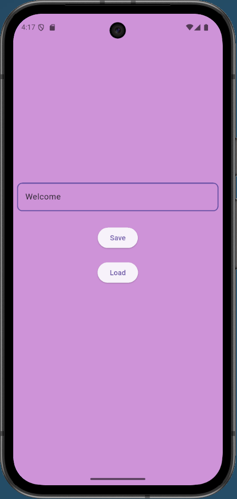
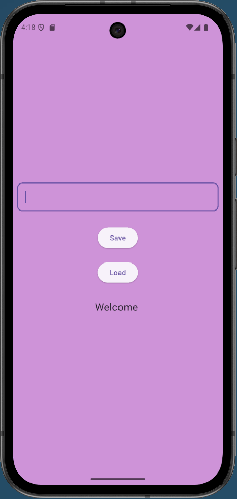

---

### 7. Json Serialization
Json translation.
* **Concepts Learned:** Converting data fromJson and toJson.
* [View Source Code](Foundation/json_serialization/)

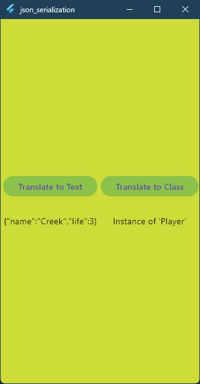

---
---

## Phase 2: Intermediate

This phase focuses on clean widget architecture, multi-screen navigation, real-time API integrations, and local data persistence.

### 1. Todo List
A task management application to add, track, and delete tasks.
* **Concepts Learned:** CRUD operations, `TextEditingController` lifecycle management (`dispose()`), and interactive list view rendering.
* [View Source Code](Intermediate/todo_list/)

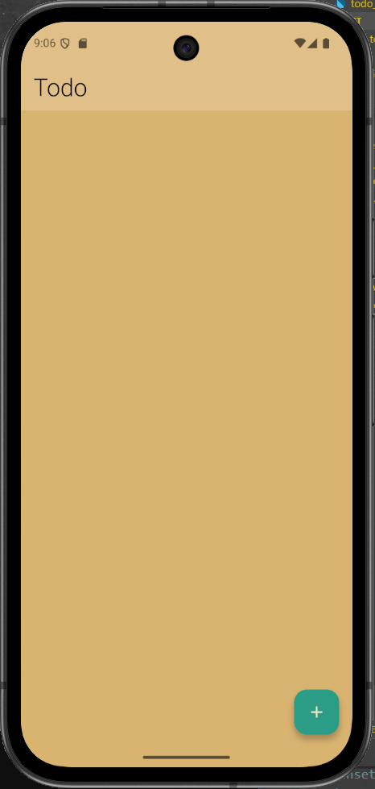
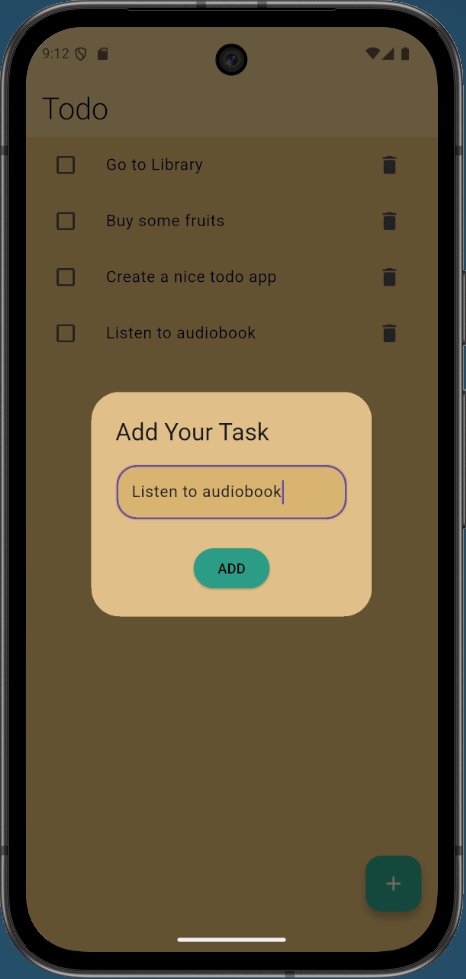
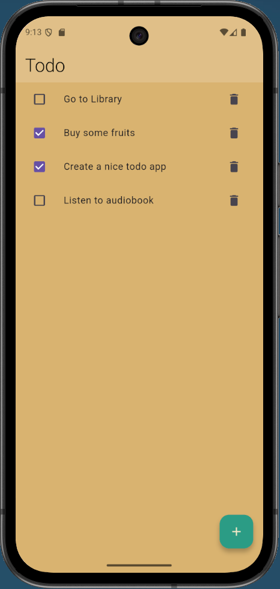

---

### 2. Weather App
A live weather application fetching real-time atmospheric data.
* **Concepts Learned:** Asynchronous programming (`async`/`await`), dynamic API requests, JSON data parsing, and updating UI states dynamically based on location inputs.
* [View Source Code](Intermediate/weather_app/)

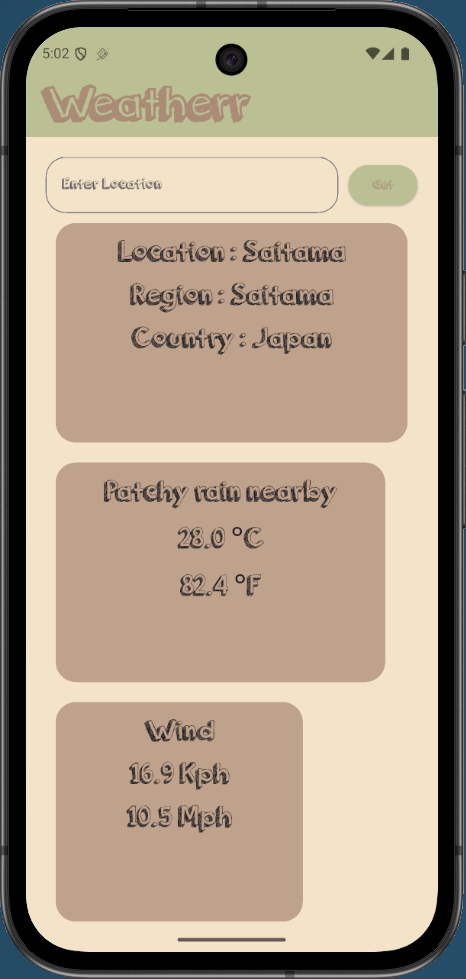
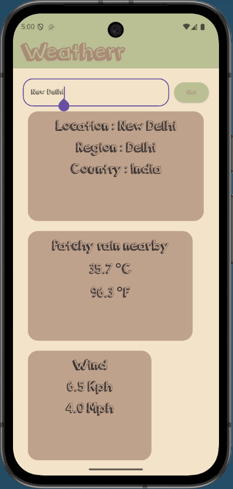

---

### 3. Recipe Book
A multi-screen application to browse recipes and view detailed ingredient and instruction cards.
* **Concepts Learned:** Multi-screen navigation, passing dynamic custom objects across screens, and `GridView` layout building.
* [View Source Code](Intermediate/recipe_book/)

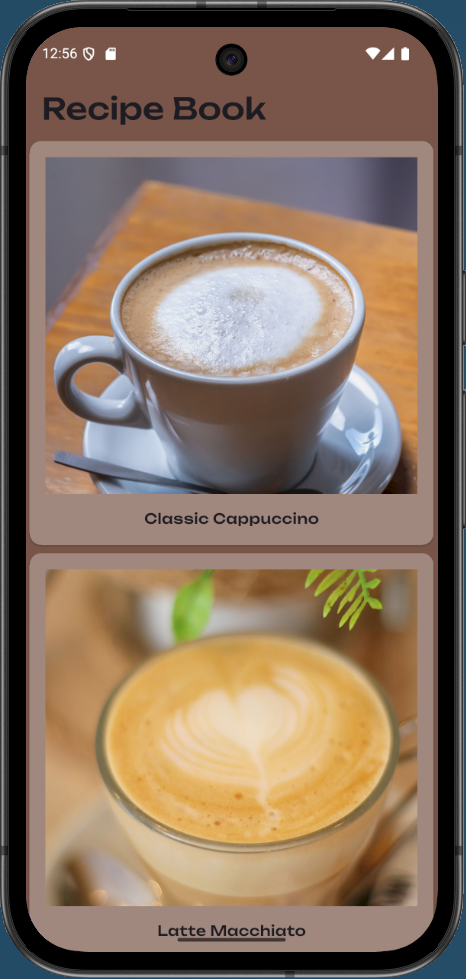
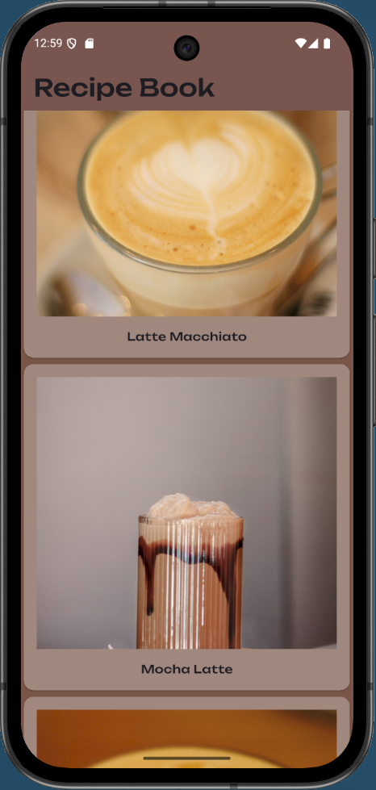
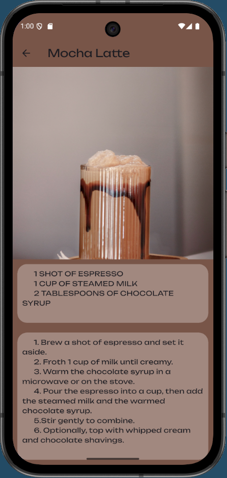
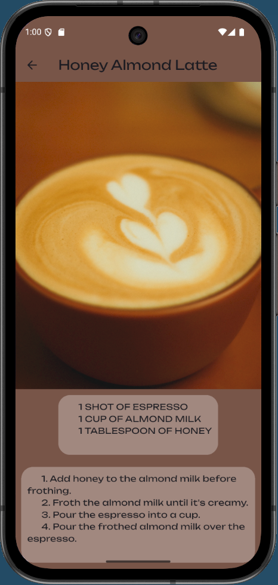

---

### 4. Expense Tracker
A financial tracking application to manage and persistently store expenses on the device.
* **Concepts Learned:** Local data persistence with `SharedPreferences`, JSON serialization (`toMap`/`fromMap`, `jsonEncode`/`jsonDecode`), Modal Bottom Sheets, and form handling.
* [View Source Code](Intermediate/expense_tracker/)

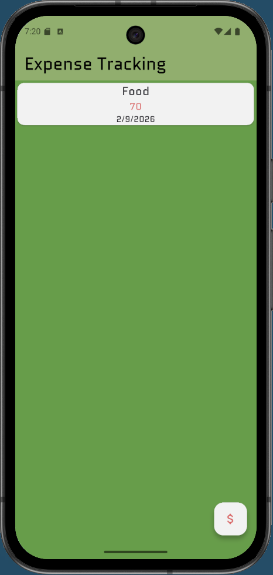
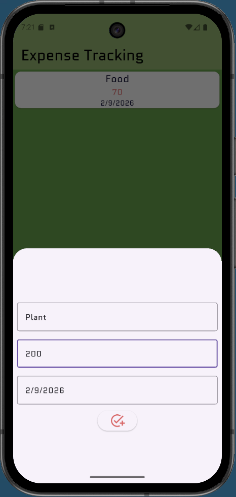
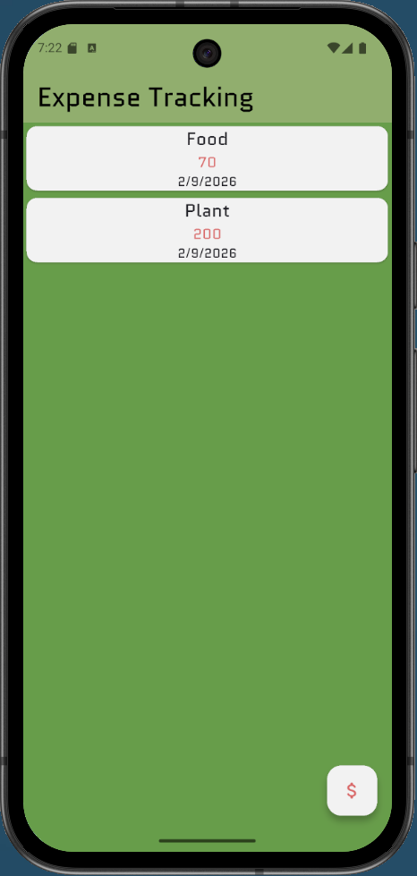
