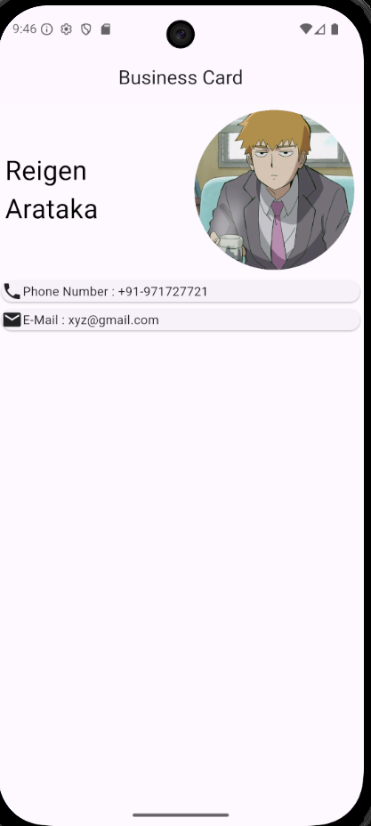
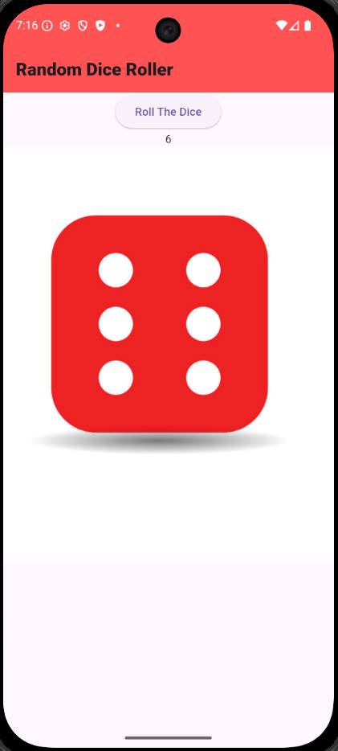
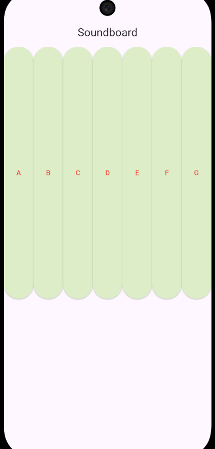
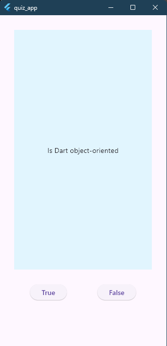
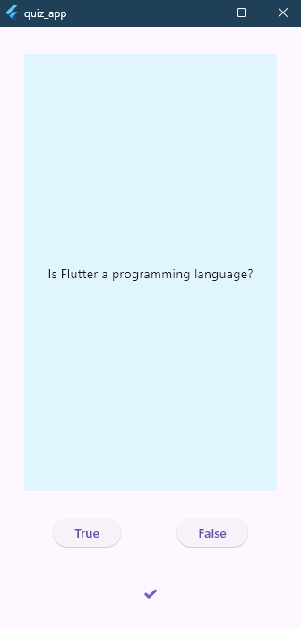
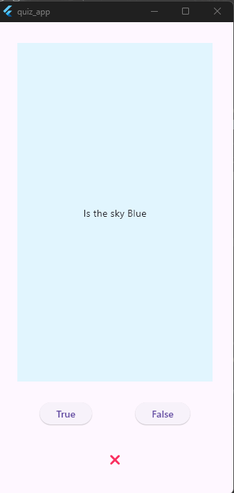
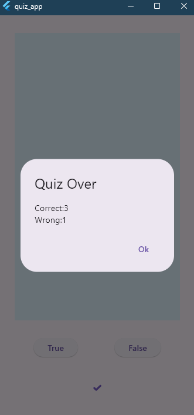

# Learning Flutter

Repository to track my progression of Learning Flutter.

---

## Phase 1: Foundation

This phase covers the core building blocks of Flutter, including widget trees, basic layouts, state management, and object-oriented programming.

### 1. Personal Business Card
A static layout application to understand the basic widget tree.
* **Concepts Learned:** `Scaffold`, `Row`, `Column`, `CircleAvatar`, and `Card`.
* [View Source Code](Foundation/personal_business_card/)

---

### 2. Dice Roller
An app to learn how data changes and how to update the screen.
* **Concepts Learned:** `StatefulWidget`, `setState()`, and dynamic image rendering.
* [View Source Code](Foundation/dice_roller/)

---

### 3. Soundboard
Audio-playing app focusing on third-party audio package.
* **Concepts Learned:** Reusable custom widgets, passing arguments, and integrating `pub.dev` packages.
* [View Source Code](Foundation/soundboard_xylophone/)

---

### 4. Quiz App
A true/false quiz game.
* **Concepts Learned:** Object-Oriented Programming (Dart Classes), Lists, logic loops, and `AlertDialog`.
* [View Source Code](Foundation/quiz_app/)

